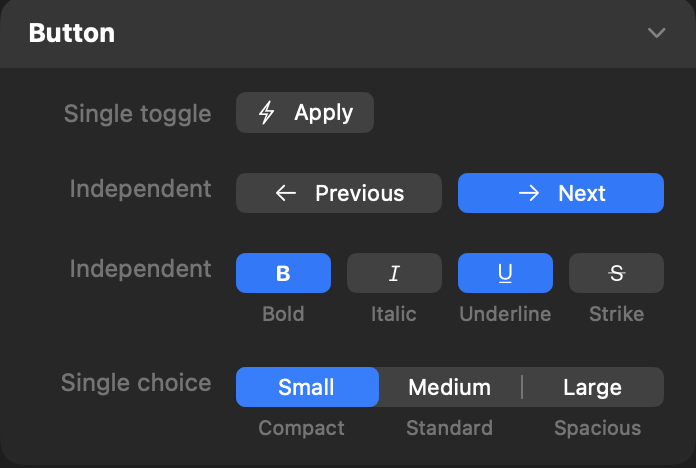



<p class="eyebrow">manifest.json · controls</p>
<h1>Button</h1>
<p class="lede">A persistent push button backed by Boolean state and optional mapped outputs.</p>


<figure class="control-screenshot">
    
    <figcaption>Single toggles, independent button arrays and a single-choice segmented picker.</figcaption>
</figure>

## Quick example

Add this dictionary to your part's `controls` array:

```json
{
    "type" : "button",
    "id" : "state",
    "buttonText" : "Featured",
    "defaults" : {
        "base" : false
    }
}
```

Use it in your HTML template:

```html
<div data-state="{{ control.state }}">Content</div>
```


## Basic properties

Each item in `controls` defines one Inspector item. These keys set its name, placement, initial value and responsive behaviour where applicable.

<h3 class="property-heading"><code>type</code></h3>
<div class="property-meta"><span class="property-type">String</span><span class="required">Required</span></div>

Identifies this item as Button. Always use `button`.

```json
"type" : "button"
```


<h3 class="property-heading"><code>id</code></h3>
<div class="property-meta"><span class="property-type">String</span><span class="required">Required</span></div>

The unique name used to store this control and read it in templates. It must start with a letter and may contain letters, numbers, underscores and hyphens.

```json
"id" : "state"
```

<h3 class="property-heading"><code>label</code></h3>
<div class="property-meta"><span class="property-type">String</span><span class="optional">Optional</span><span class="default">Default: empty</span></div>

Text shown to the left of the control in the Inspector, including when `count` is present.

```json
"label" : "Button"
```

<h3 class="property-heading"><code>group</code></h3>
<div class="property-meta"><span class="property-type">String</span><span class="optional">Optional</span><span class="default">Default: Settings</span></div>

The Inspector section that contains this control. Omit the key to place it in Settings.

```json
"group" : "Appearance"
```

<h3 class="property-heading"><code>tooltip</code></h3>
<div class="property-meta"><span class="property-type">String</span><span class="optional">Optional</span><span class="default">Default: omitted</span></div>

Help text that explains what the control changes.

```json
"tooltip" : "Choose a value."
```

<h3 class="property-heading"><code>subtitle</code></h3>
<div class="property-meta"><span class="property-type">String or String array</span><span class="optional">Optional</span><span class="default">Default: empty</span></div>

Supporting text shown beneath the control. Use a String for one control or a String array with `count`.

Single control

```json
"subtitle" : "Additional guidance"
```

Control array

```json
"subtitle" : [
    "First value",
    "Second value"
]
```

<h3 class="property-heading"><code>visibleWhen</code></h3>
<div class="property-meta"><span class="property-type">Dictionary</span><span class="optional">Optional</span><span class="default">Default: shown</span></div>

Shows this control only when another control meets the stated condition.

```json
"visibleWhen" : {
    "id" : "showControl",
    "value" : true
}
```

<h3 class="property-heading"><code>valueAvailability</code></h3>
<div class="property-meta"><span class="property-type">String</span><span class="optional">Optional</span><span class="default">Default: always</span></div>

Controls when this control's value is available to templates. `always` preserves the value when the control is hidden. `whenVisible` makes `control.<id>` and its qualified derived values unavailable while `visibleWhen` is false, without discarding the stored value. `whenVisible` requires `visibleWhen`. See [Conditional visibility](visible-when.html).

<h3 class="property-heading"><code>defaults</code></h3>
<div class="property-meta"><span class="property-type">Dictionary</span><span class="required">Required</span></div>

A dictionary containing the required `base` value and optional breakpoint values: `small`, `medium`, `large`, `extraLarge`, and `doubleExtraLarge`. Breakpoint entries require `responsive: true`. Every entry uses the complete value format described below; omitted breakpoints inherit the preceding enabled value. Disabled project breakpoints are skipped without discarding their declarations. User overrides take precedence at the same breakpoint. Resetting an override restores the default cascade.

<h3 class="property-heading"><code>defaults.base</code></h3>
<div class="property-meta"><span class="property-type">Boolean or Boolean array</span><span class="required">Required</span></div>

The Boolean state initially stored by the Inspector. A control array requires exactly one Boolean for each button.

Single control

```json
"defaults" : {
    "base" : false
}
```

Control array

```json
"defaults" : {
    "base" : [
        false,
        false
    ]
}
```

<h3 class="property-heading"><code>responsive</code></h3>
<div class="property-meta"><span class="property-type">Boolean</span><span class="optional">Optional</span><span class="default">Default: false</span></div>

Set to true to allow a different value at each responsive breakpoint.

```json
"responsive" : false
```

## Button options

These keys sit directly in the same custom-item dictionary. Omitted optional keys use the defaults shown.

<h3 class="property-heading"><code>count</code></h3>
<div class="property-meta"><span class="property-type">Integer</span><span class="optional">Optional</span><span class="default">Default: omitted</span></div>

Creates two to four controls that are stored as one array. Read each value with a zero-based index such as `{{ control.myControl[0] }}`.

Control array

```json
"count" : 2
```

<h3 class="property-heading"><code>selectionMode</code></h3>
<div class="property-meta"><span class="property-type">String</span><span class="optional">Optional</span><span class="default">Default: multiple</span></div>

Controls how Buttons behave when `count` is present.

- `multiple` displays up to four independent Buttons. Any number may be active.
- `single` displays one segmented Picker and keeps exactly one segment selected.

With `single`, the `defaults.base` array must contain exactly one `true` value.

```json
"selectionMode" : "single"
```

<h3 class="property-heading"><code>buttonText</code></h3>
<div class="property-meta"><span class="property-type">String or String array</span><span class="optional">Optional</span><span class="default">Default: Button when no icon</span></div>

Text displayed inside the Button. With `count`, supply a String array to set the text for each Button.

When `buttonIcon` is present and the corresponding text is omitted or empty, Foundry displays an icon-only Button. When both text and icon are omitted, Foundry displays `Button`.

Single control

```json
"buttonText" : "Apply"
```

Control array

```json
"buttonText" : [
    "Previous",
    "Next"
]
```

<h3 class="property-heading"><code>buttonIcon</code></h3>
<div class="property-meta"><span class="property-type">String or String array</span><span class="optional">Optional</span><span class="default">Default: omitted</span></div>

SF Symbol displayed beside `buttonText`. With `count`, provide an array to assign a different icon to each Button.

```json
"buttonIcon" : [
    "arrow.left",
    "arrow.right"
]
```

<h3 class="property-heading"><code>activeButtonText</code></h3>
<div class="property-meta"><span class="property-type">String or String array</span><span class="optional">Optional</span><span class="default">Default: buttonText</span></div>

Replacement Button text while its stored state is `true`. With `count`, each entry corresponds to the Button at the same index.

```json
"activeButtonText" : "Applied"
```

<h3 class="property-heading"><code>activeButtonIcon</code></h3>
<div class="property-meta"><span class="property-type">String or String array</span><span class="optional">Optional</span><span class="default">Default: buttonIcon</span></div>

Replacement SF Symbol while a Button's stored state is `true`. With `count`, each entry corresponds to the Button at the same index.

```json
"activeButtonIcon" : "checkmark"
```

<h3 class="property-heading"><code>trueValue</code></h3>
<div class="property-meta"><span class="property-type">String, Number, Boolean or array</span><span class="optional">Optional</span><span class="default">Default: true</span></div>

The value supplied to templates while the stored Boolean state is `true`. With `selectionMode` `multiple`, use one value for every Button or an array containing exactly `count` mapped values. With `single`, an array maps each segment to the scalar value returned when selected.

```json
"trueValue" : "active"
```

<h3 class="property-heading"><code>falseValue</code></h3>
<div class="property-meta"><span class="property-type">String, Number, Boolean or array</span><span class="optional">Optional</span><span class="default">Default: false</span></div>

The value supplied to templates while the stored Boolean state is `false`. This applies to single Buttons and `multiple` Button arrays; a `single` segmented Picker returns only its selected `trueValue`.

```json
"falseValue" : "idle"
```

<div class="guidance" markdown="1">
<h3>Stored state and returned output</h3>

Pressing an independent Button toggles its stored Boolean state. A `false` Button uses the bordered appearance; a `true` Button uses the prominent bordered appearance. A `single` Button array uses a segmented Picker and stores its selection as a Boolean array.
</div>

## Return value

For a single Button, `{{ control.state }}` resolves to its mapped value or Boolean state. A `multiple` Button array resolves to an array. A `single` segmented Picker always has one selection and resolves to the selected entry in `trueValue`, or its zero-based selected index when `trueValue` is omitted.

```text
data-state="{{ control.state }}"
```

## Complete example

### manifest.json

```json
"controls" : [
    {
        "id" : "state",
        "label" : "Button",
        "group" : "Content",
        "type" : "button",
        "buttonText" : "Apply",
        "buttonIcon" : "bolt.fill",
        "trueValue" : "active",
        "falseValue" : "idle",
        "defaults" : {
            "base" : false
        },
        "responsive" : false
    }
]
```

### Use it in a template

```text
data-state="{{ control.state }}"
```


