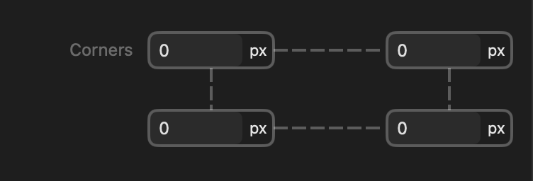



<p class="eyebrow">Info.plist · controls</p>
<h1>Corners</h1>
<p class="lede">A four-corner box editor for raw lengths with all-or-none linking. The general-purpose version of the framework radius control: your units, no framework values.</p>

<figure class="control-screenshot">
    
    <figcaption>Each corner's field sits at its own corner, joined by the single all-or-none link ring. Every field is a number with a unit menu; there is no framework/custom mode button.</figcaption>
</figure>

## Quick example

Add this dictionary to your part's `controls` array:

```xml
<dict>
    <key>type</key><string>corners</string>
    <key>id</key><string>clipRadius</string>
    <key>label</key><string>Clip radius</string>
    <key>defaults</key>
    <dict>
        <key>base</key>
        <dict>
            <key>value</key><real>0</real>
            <key>unit</key><string>px</string>
        </dict>
    </dict>
</dict>
```

Use it in the part's CSS template:

```css
:instance {
    clip-path: inset(0 round {{ control.clipRadius }});
}
```

## Properties

<h3 class="property-heading"><code>type</code></h3>
<div class="property-meta"><span class="property-type">String</span><span class="required">Required</span></div>

Always `corners`. The control shows the same four-corner grid editor as [Framework radius](framework-radius-control.html), but every corner is always a plain number field with a unit menu — there is no framework-value picker and no framework/custom mode button. Use the framework radius control instead when authors should choose from the framework's radius scale.

It does not accept `count`, `options`, `frameworkValues`, `allowsCustom`, `minimum`, `maximum`, or `step`. Only the properties listed on this page are accepted.

<h3 class="property-heading"><code>id</code></h3>
<div class="property-meta"><span class="property-type">String</span><span class="required">Required</span></div>

Unique control identifier, starting with a letter and containing letters, numbers, underscores or hyphens. Templates access its fields through `{{ control.yourID.topLeft }}` or its complete shorthand through `{{ control.yourID }}`.

<h3 class="property-heading"><code>label</code></h3>
<div class="property-meta"><span class="property-type">String</span><span class="optional">Optional</span><span class="default">Default: Corners</span></div>

The control's label in the Inspector's normal left-hand label column. An omitted, empty or whitespace-only label displays Corners. The four corner fields are Top Left, Top Right, Bottom Left and Bottom Right.

<h3 class="property-heading"><code>group</code></h3>
<div class="property-meta"><span class="property-type">String</span><span class="optional">Optional</span><span class="default">Default: Settings</span></div>

The Inspector section containing the control.

<h3 class="property-heading"><code>units</code></h3>
<div class="property-meta"><span class="property-type">String array</span><span class="optional">Optional</span><span class="default">Default: px, rem, em, %</span></div>

The units offered by each corner's unit menu, in menu order. Accepts a non-empty array of distinct values from `px`, `rem`, `em`, and `%`. Every default must use one of the declared units.

<h3 class="property-heading"><code>linked</code></h3>
<div class="property-meta"><span class="property-type">Boolean</span><span class="optional">Optional</span><span class="default">Default: inferred from defaults</span></div>

The starting link state. Omitted, it is inferred: equal corner defaults start linked, differing corners start unlinked. Declare `false` to start equal defaults unlinked. `true` requires all four corner defaults to be equal. Authors can always change the link state afterwards.

<h3 class="property-heading"><code>defaults</code></h3>
<div class="property-meta"><span class="property-type">Dictionary</span><span class="required">Required</span></div>

A dictionary containing the required `base` value and optional breakpoint values: `small`, `medium`, `large`, `extraLarge`, and `doubleExtraLarge`. Breakpoint entries require `responsive: true`. Every entry uses the complete value format described below; omitted breakpoints inherit the preceding enabled value. Disabled project breakpoints are skipped without discarding their declarations. User overrides take precedence at the same breakpoint. Resetting an override restores the default cascade.

<h3 class="property-heading"><code>defaults.base</code></h3>
<div class="property-meta"><span class="property-type">Dictionary</span><span class="required">Required</span></div>

One length for every corner, or a dictionary containing all four keys: `topLeft`, `topRight`, `bottomRight` and `bottomLeft`. Each length is a dictionary containing exactly `value` (a finite, nonnegative Number) and `unit` (one of the declared units). Framework tokens, `none`, `auto`, negative lengths, arrays and raw CSS strings are not accepted.

```xml
<key>defaults</key><dict><key>base</key><dict>
    <key>value</key><real>8</real><key>unit</key><string>px</string>
</dict></dict>
```

Each corner's field sits at its own corner of a two-by-two grid. A shared default, or a four-corner dictionary whose corners are all equal, starts linked; any differing corner starts the control unlinked. Declare `linked` to override the inferred state. All four corner fields remain visible in every state.

One link joins all four corners — there is no pair linking. It is drawn as a ring of segments between adjacent fields, and clicking any segment toggles it. Linked, every corner shares one length, and completing the link copies Top Left to all four. Unlinking preserves values and makes every corner independent. Linking shares the complete amount and unit; it does not merely copy the displayed number.

<h3 class="property-heading"><code>responsive</code></h3>
<div class="property-meta"><span class="property-type">Boolean</span><span class="optional">Optional</span><span class="default">Default: false</span></div>

Allows the whole four-corner value to override at a responsive breakpoint. There is one responsive indicator beside the main label, not one per corner. Editing at an overridden breakpoint stores all four selections and their link state together. The value is shared between light and dark appearances.

<h3 class="property-heading"><code>tooltip</code></h3>
<div class="property-meta"><span class="property-type">String</span><span class="optional">Optional</span><span class="default">Default: Corners</span></div>

Help text for the overall control. Individual buttons retain their action-specific help.

<h3 class="property-heading"><code>subtitle</code></h3>
<div class="property-meta"><span class="property-type">String</span><span class="optional">Optional</span><span class="default">Default: empty</span></div>

Supporting text beneath the four-corner editor. Arrays are not accepted because this control does not support `count`.

<h3 class="property-heading"><code>visibleWhen</code></h3>
<div class="property-meta"><span class="property-type">Dictionary</span><span class="optional">Optional</span><span class="default">Default: shown</span></div>

Shows the complete control when another control meets the declared condition. See [Conditional visibility](visible-when.html). The value is structured, not a scalar comparison source.
<h3 class="property-heading"><code>valueAvailability</code></h3>
<div class="property-meta"><span class="property-type">String</span><span class="optional">Optional</span><span class="default">Default: always</span></div>

Controls when this control's value is available to templates. `always` preserves the value when the control is hidden. `whenVisible` makes `control.<id>` and its qualified derived values unavailable while `visibleWhen` is false, without discarding the stored value. `whenVisible` requires `visibleWhen`. See [Conditional visibility](visible-when.html).


## Return value

Use `{{ control.yourID }}` directly to output the four CSS lengths in shorthand order: top left, top right, bottom right, bottom left. Qualified fields remain available:

- `topLeft`, `topRight`, `bottomRight`, `bottomLeft`: individual CSS lengths.
- `css`: the four lengths in CSS shorthand order: top left, top right, bottom right, bottom left.
- `values`: an object containing the numeric amount for each corner (`topLeft`, `topRight`, `bottomRight`, `bottomLeft`).
- `units`: an object containing the corresponding unit String for each corner.

Every length is the entered amount with its unit — there are no CSS variable references, because the value never comes from the framework. Numeric amounts are usable in template expressions and JavaScript.

Declaring the control does not apply anything automatically; the template chooses which CSS property receives the value.

## Example

```xml
<dict>
    <key>type</key><string>corners</string>
    <key>id</key><string>maskRadius</string>
    <key>label</key><string>Mask radius</string>
    <key>group</key><string>Appearance</string>
    <key>units</key><array><string>px</string><string>%</string></array>
    <key>defaults</key><dict><key>base</key><dict>
        <key>value</key><real>12</real><key>unit</key><string>px</string>
    </dict></dict>
    <key>responsive</key><true/>
</dict>
```

```css
:instance img {
    border-radius: {{ control.maskRadius }};
}
```

