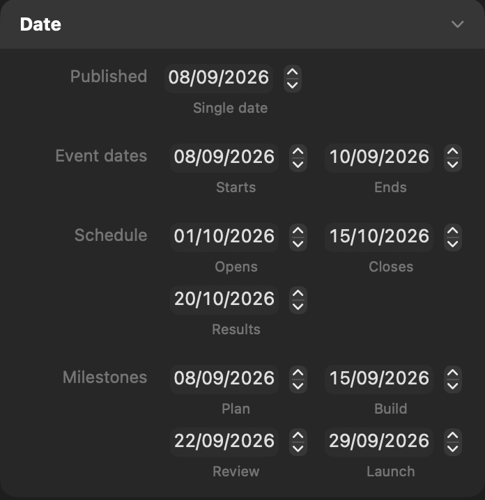



<p class="eyebrow">manifest.json · inspector</p>
<h1>Date</h1>
<p class="lede">A native calendar-date picker storing a date-only ISO String.</p>


<figure class="control-screenshot">
    
    <figcaption>A single date and several indexed arrays, with developer-provided subtitles.</figcaption>
</figure>

## Quick example

Add this dictionary to your part's `inspector` array:

```json
{
    "type" : "date",
    "id" : "published",
    "defaults" : {
        "base" : "2026-08-30"
    }
}
```

Use it in your HTML template:

```html
<time datetime="{{ control.published }}">{{ control.published | formatDate("d MMMM yyyy") }}</time>
```


## Basic properties

Each item in the `inspector` array defines one Inspector item. These keys set its name, initial value and responsive behaviour where applicable.

<h3 class="property-heading"><code>type</code></h3>
<div class="property-meta"><span class="property-type">String</span><span class="required">Required</span></div>

Identifies this item as Date. Always use `date`.

```json
"type" : "date"
```


<h3 class="property-heading"><code>id</code></h3>
<div class="property-meta"><span class="property-type">String</span><span class="required">Required</span></div>

The unique name used to store this control and read it in templates. It must start with a letter and may contain letters, numbers, underscores and hyphens.

```json
"id" : "published"
```

<h3 class="property-heading"><code>label</code></h3>
<div class="property-meta"><span class="property-type">String</span><span class="optional">Optional</span><span class="default">Default: empty</span></div>

Text shown to the left of the control in the Inspector, including when `count` is present.

```json
"label" : "Date"
```

<h3 class="property-heading"><code>tooltip</code></h3>
<div class="property-meta"><span class="property-type">String</span><span class="optional">Optional</span><span class="default">Default: omitted</span></div>

Help text that explains what the control changes.

```json
"tooltip" : "Choose a value."
```

<h3 class="property-heading"><code>subtitle</code></h3>
<div class="property-meta"><span class="property-type">String or String array</span><span class="optional">Optional</span><span class="default">Default: empty</span></div>

Supporting text shown beneath the control. Use a String for one control or a String array with `count`.

Single control

```json
"subtitle" : "Additional guidance"
```

Control array

```json
"subtitle" : [
    "First value",
    "Second value"
]
```

<h3 class="property-heading"><code>visibleWhen</code></h3>
<div class="property-meta"><span class="property-type">Dictionary</span><span class="optional">Optional</span><span class="default">Default: shown</span></div>

Shows this control only when another control meets the stated condition.

```json
"visibleWhen" : {
    "id" : "showControl",
    "value" : true
}
```

<h3 class="property-heading"><code>valueAvailability</code></h3>
<div class="property-meta"><span class="property-type">String</span><span class="optional">Optional</span><span class="default">Default: always</span></div>

Controls when this control's value is available to templates. `always` preserves the value when the control is hidden. `whenVisible` makes `control.<id>` and its qualified derived values unavailable while `visibleWhen` is false, without discarding the stored value. `whenVisible` requires `visibleWhen`. See [Conditional visibility](visible-when.html).

<h3 class="property-heading"><code>defaults</code></h3>
<div class="property-meta"><span class="property-type">Dictionary</span><span class="required">Required</span></div>

A dictionary containing the required `base` value and optional breakpoint values: `small`, `medium`, `large`, `extraLarge`, and `doubleExtraLarge`. Breakpoint entries require `responsive: true`. Every entry uses the complete value format described below; omitted breakpoints inherit the preceding enabled value. Disabled project breakpoints are skipped without discarding their declarations. User overrides take precedence at the same breakpoint. Resetting an override restores the default cascade.

<h3 class="property-heading"><code>defaults.base</code></h3>
<div class="property-meta"><span class="property-type">String or String array</span><span class="required">Required</span></div>

The value initially stored for this control. Supply a real calendar date using `YYYY-MM-DD`. A control array needs one value for each member.

Single control

```json
"defaults" : {
    "base" : "2026-08-30"
}
```

Control array

```json
"defaults" : {
    "base" : [
        "2026-08-30",
        "2026-09-06"
    ]
}
```

<h3 class="property-heading"><code>responsive</code></h3>
<div class="property-meta"><span class="property-type">Boolean</span><span class="optional">Optional</span><span class="default">Default: false</span></div>

Set to true to allow a different value at each responsive breakpoint.

```json
"responsive" : false
```

## Date options

These keys sit directly in the same custom-item dictionary. Omitted optional keys use the defaults shown.

<h3 class="property-heading"><code>minimum</code></h3>
<div class="property-meta"><span class="property-type">String</span><span class="optional">Optional</span><span class="default">Default: unrestricted</span></div>

The earliest date the site author may select. Use `YYYY-MM-DD`. The default date cannot be earlier than this value.

```json
"minimum" : "2026-01-01"
```

<h3 class="property-heading"><code>maximum</code></h3>
<div class="property-meta"><span class="property-type">String</span><span class="optional">Optional</span><span class="default">Default: unrestricted</span></div>

The latest date the site author may select. Use `YYYY-MM-DD`. It must be the same as or later than `minimum`, and the default date cannot be later than this value.

```json
"maximum" : "2026-12-31"
```

With `count`, the same optional bounds apply to every date picker.

<h3 class="property-heading"><code>count</code></h3>
<div class="property-meta"><span class="property-type">Integer</span><span class="optional">Optional</span><span class="default">Default: omitted</span></div>

Creates two to four controls that are stored as one array. Read each value with a zero-based index such as `{{ control.myControl[0] }}`.

Control array

```json
"count" : 2
```

## Return value

`{{ control.published }}` resolves as an HTML-escaped `YYYY-MM-DD` String. It contains no hidden time or timezone.

```html
<time datetime="{{ control.published }}">{{ control.published }}</time>
```

## Date values

Each selected date also provides named calendar values:

- `year`, `month` and `day` return numbers.
- `monthName` returns the full English month name.
- `weekday` returns the full English weekday name.

```text
{{ control.published.year }}
{{ control.published.month }}
{{ control.published.day }}
{{ control.published.monthName }}
{{ control.published.weekday }}
```

With `count`, place the zero-based index before the named value:

```text
{{ control.schedule[0].weekday }}
{{ control.schedule[1].day }}
```

Named numeric values may also be used in template expressions.

## Formatting visible dates

Use `formatDate("pattern")` when displaying a date to a reader. Patterns use Unicode date-field symbols and produce deterministic English output. The stored value remains unchanged.

```html
<time datetime="{{ control.published }}">
    {{ control.published | formatDate("d MMMM yyyy") }}
</time>
```

This produces visible text such as `30 August 2026` while retaining `2026-08-30` in the machine-readable `datetime` attribute.

Control arrays support the same filter:

```html
<time datetime="{{ control.schedule[0] }}">{{ control.schedule[0] | formatDate("d MMM") }}</time>–<time datetime="{{ control.schedule[1] }}">{{ control.schedule[1] | formatDate("d MMM yyyy") }}</time>
```

## Date arithmetic

Use `addDays(integer)` or `addMonths(integer)` to derive a related date without adding another Inspector control. Positive values move forward and negative values move backward. Filters run from left to right and do not change the stored date.

The integer may be written directly or supplied by a Number control. A `formatDate` pattern may likewise be supplied by a Text control.

```text
{{ control.published | addDays(7) }}
{{ control.published | addDays(control.reviewDelay) }}
{{ control.published | addMonths(1) | formatDate("d MMMM yyyy") }}
{{ control.published | formatDate(control.datePattern) }}
```

Calendar arithmetic handles differing month lengths. For example, adding one month to the final day of January produces the final valid day of February.

## Complete example

### manifest.json

```json
"inspector" : [
    {
        "id" : "published",
        "label" : "Date",
        "type" : "date",
        "minimum" : "2026-01-01",
        "maximum" : "2026-12-31",
        "defaults" : {
            "base" : "2026-08-30"
        },
        "responsive" : false
    }
]
```

### Use it in a template

```html
<time datetime="{{ control.published }}">{{ control.published | formatDate("d MMMM yyyy") }}</time>
```


