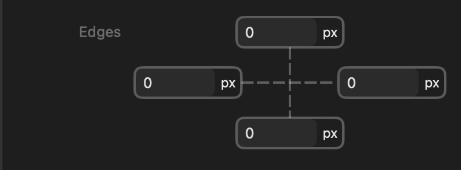



<p class="eyebrow">manifest.json · inspector</p>
<h1>Edges</h1>
<p class="lede">A four-edge box editor for raw lengths with coordinated linking. The general-purpose version of the framework spacing controls: your units, no framework values.</p>

<figure class="control-screenshot">
    
    <figcaption>Every edge is a number field with a unit menu. The pair link lines work exactly as in the framework spacing controls; there is no framework/custom mode button.</figcaption>
</figure>

## Quick example

Add this dictionary to your part's `inspector` array:

```json
{
    "type" : "edges",
    "id" : "inset",
    "label" : "Inset",
    "defaults" : {
        "base" : {
            "value" : 0.0,
            "unit" : "px"
        }
    }
}
```

Use it in the part's CSS template:

```css
:instance {
    inset: {{ control.inset }};
}
```

## Properties

<h3 class="property-heading"><code>type</code></h3>
<div class="property-meta"><span class="property-type">String</span><span class="required">Required</span></div>

Always `edges`. The control shows the same four-edge box editor as [Framework padding](framework-padding-control.html) and [Framework margin](framework-margin-control.html), but every edge is always a plain number field with a unit menu — there is no framework-value picker and no framework/custom mode button. Use a framework spacing control instead when authors should choose from the framework's spacing scale.

It does not accept `count`, `options`, `frameworkValues`, `allowsCustom`, `minimum`, `maximum`, or `step`. Only the properties listed on this page are accepted.

<h3 class="property-heading"><code>id</code></h3>
<div class="property-meta"><span class="property-type">String</span><span class="required">Required</span></div>

Unique control identifier, starting with a letter and containing letters, numbers, underscores or hyphens. Templates access its fields through `{{ control.yourID.top }}` or its complete shorthand through `{{ control.yourID }}`.

<h3 class="property-heading"><code>label</code></h3>
<div class="property-meta"><span class="property-type">String</span><span class="optional">Optional</span><span class="default">Default: Edges</span></div>

The control's label in the Inspector's normal left-hand label column. An omitted, empty or whitespace-only label displays Edges. The four edge fields are Top, Bottom, Left and Right.

<h3 class="property-heading"><code>units</code></h3>
<div class="property-meta"><span class="property-type">String array</span><span class="optional">Optional</span><span class="default">Default: px, rem, em, %</span></div>

The units offered by each edge's unit menu, in menu order. Accepts a non-empty array of distinct values from `px`, `rem`, `em`, and `%`. Every default must use one of the declared units.

```json
"units" : [
    "px",
    "%"
]
```

<h3 class="property-heading"><code>linked</code></h3>
<div class="property-meta"><span class="property-type">Boolean</span><span class="optional">Optional</span><span class="default">Default: inferred from defaults</span></div>

The starting link state. Omitted, it is inferred: equal edge defaults start with both pairs linked, differing edges start unlinked. Declare `false` to start equal defaults unlinked. `true` requires all four edge defaults to be equal. Authors can always change the link state afterwards.

<h3 class="property-heading"><code>defaults</code></h3>
<div class="property-meta"><span class="property-type">Dictionary</span><span class="required">Required</span></div>

A dictionary containing the required `base` value and optional breakpoint values: `small`, `medium`, `large`, `extraLarge`, and `doubleExtraLarge`. Breakpoint entries require `responsive: true`. Every entry uses the complete value format described below; omitted breakpoints inherit the preceding enabled value. Disabled project breakpoints are skipped without discarding their declarations. User overrides take precedence at the same breakpoint. Resetting an override restores the default cascade.

<h3 class="property-heading"><code>defaults.base</code></h3>
<div class="property-meta"><span class="property-type">Dictionary</span><span class="required">Required</span></div>

One length for every edge, or a dictionary containing all four keys: `top`, `right`, `bottom` and `left`. Each length is a dictionary containing exactly `value` (a finite Number; negative values are permitted) and `unit` (one of the declared units). Framework tokens, `none`, `auto`, arrays and raw CSS strings are not accepted.

```json
"defaults" : {
    "base" : {
        "value" : 1.5,
        "unit" : "rem"
    }
}
```

For different initial values:

```json
"defaults" : {
    "base" : {
        "top" : {
            "value" : 0.0,
            "unit" : "px"
        },
        "right" : {
            "value" : 16.0,
            "unit" : "px"
        },
        "bottom" : {
            "value" : 0.0,
            "unit" : "px"
        },
        "left" : {
            "value" : 16.0,
            "unit" : "px"
        }
    }
}
```

A shared default, or a four-edge dictionary whose edges are all equal, starts with both pairs linked; any differing edge starts the control fully unlinked. Declare `linked` to override the inferred state. All four edge fields remain visible in every state.

Two link buttons connect the edges: one links Top–Bottom using Top, the other links Left–Right using Left, regardless of which end was clicked. With both pairs linked, all four edges edit together, and completing the second link copies its own pair's leading edge — Top or Left — to all four. Unlinking preserves values. Linking shares the complete amount and unit; it does not merely copy the displayed number.

<h3 class="property-heading"><code>responsive</code></h3>
<div class="property-meta"><span class="property-type">Boolean</span><span class="optional">Optional</span><span class="default">Default: false</span></div>

Allows the whole four-edge value to override at a responsive breakpoint. There is one responsive indicator beside the main label, not one per edge. Editing at an overridden breakpoint stores all four selections and their link state together. The value is shared between light and dark appearances.

<h3 class="property-heading"><code>tooltip</code></h3>
<div class="property-meta"><span class="property-type">String</span><span class="optional">Optional</span><span class="default">Default: Edges</span></div>

Help text for the overall control. Individual buttons retain their action-specific help.

<h3 class="property-heading"><code>subtitle</code></h3>
<div class="property-meta"><span class="property-type">String</span><span class="optional">Optional</span><span class="default">Default: empty</span></div>

Supporting text beneath the four-edge editor. Arrays are not accepted because this control does not support `count`.

<h3 class="property-heading"><code>visibleWhen</code></h3>
<div class="property-meta"><span class="property-type">Dictionary</span><span class="optional">Optional</span><span class="default">Default: shown</span></div>

Shows the complete control when another control meets the declared condition. See [Conditional visibility](visible-when.html). The value is structured, not a scalar comparison source.
<h3 class="property-heading"><code>valueAvailability</code></h3>
<div class="property-meta"><span class="property-type">String</span><span class="optional">Optional</span><span class="default">Default: always</span></div>

Controls when this control's value is available to templates. `always` preserves the value when the control is hidden. `whenVisible` makes `control.<id>` and its qualified derived values unavailable while `visibleWhen` is false, without discarding the stored value. `whenVisible` requires `visibleWhen`. See [Conditional visibility](visible-when.html).


## Return value

Use `{{ control.yourID }}` directly to output the four CSS lengths in shorthand order: top, right, bottom, left. Qualified fields remain available:

- `top`, `right`, `bottom`, `left`: individual CSS lengths.
- `css`: the four lengths in CSS shorthand order: top, right, bottom, left.
- `values`: an object containing the numeric amount for each edge (`top`, `right`, `bottom`, `left`).
- `units`: an object containing the corresponding unit String for each edge.

Every length is the entered amount with its unit — there are no CSS variable references, because the value never comes from the framework. Numeric amounts are usable in template expressions and JavaScript.

Declaring the control does not apply anything automatically; the template chooses which CSS property receives the value.

## Example

```json
{
    "type" : "edges",
    "id" : "scrollMargin",
    "label" : "Scroll margin",
    "units" : [
        "px",
        "rem"
    ],
    "defaults" : {
        "base" : {
            "value" : 0.0,
            "unit" : "px"
        }
    },
    "responsive" : true
}
```

```css
:instance {
    scroll-margin: {{ control.scrollMargin }};
}
```

