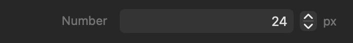



<p class="eyebrow">manifest.json · controls</p>
<h1>Number</h1>
<p class="lede">A numeric text field with bounds, increments and an optional displayed unit.</p>


<figure class="control-screenshot">
    
    <figcaption>Numeric entry, stepper buttons and the declared unit.</figcaption>
</figure>

## Quick example

Add this dictionary to your part's `controls` array:

```json
{
    "type" : "number",
    "id" : "spacing",
    "minimum" : 0.0,
    "maximum" : 100.0,
    "defaults" : {
        "base" : 24.0
    }
}
```

Use it in the part's CSS template:

```css
:instance {
    padding: {{ control.spacing }}px;
}
```


## Basic properties

Each item in `controls` defines one Inspector item. These keys set its name, placement, initial value and responsive behaviour where applicable.

<h3 class="property-heading"><code>type</code></h3>
<div class="property-meta"><span class="property-type">String</span><span class="required">Required</span></div>

Identifies this item as Number. Always use `number`.

```json
"type" : "number"
```


<h3 class="property-heading"><code>id</code></h3>
<div class="property-meta"><span class="property-type">String</span><span class="required">Required</span></div>

The unique name used to store this control and read it in templates. It must start with a letter and may contain letters, numbers, underscores and hyphens.

```json
"id" : "spacing"
```

<h3 class="property-heading"><code>label</code></h3>
<div class="property-meta"><span class="property-type">String</span><span class="optional">Optional</span><span class="default">Default: empty</span></div>

Text shown to the left of the control in the Inspector, including when `count` is present.

```json
"label" : "Number"
```

<h3 class="property-heading"><code>group</code></h3>
<div class="property-meta"><span class="property-type">String</span><span class="optional">Optional</span><span class="default">Default: Settings</span></div>

The Inspector section that contains this control. Omit the key to place it in Settings.

```json
"group" : "Appearance"
```

<h3 class="property-heading"><code>tooltip</code></h3>
<div class="property-meta"><span class="property-type">String</span><span class="optional">Optional</span><span class="default">Default: omitted</span></div>

Help text that explains what the control changes.

```json
"tooltip" : "Choose a value."
```

<h3 class="property-heading"><code>subtitle</code></h3>
<div class="property-meta"><span class="property-type">String or String array</span><span class="optional">Optional</span><span class="default">Default: empty</span></div>

Supporting text shown beneath the control. Use a String for one control or a String array with `count`.

Single control

```json
"subtitle" : "Additional guidance"
```

Control array

```json
"subtitle" : [
    "First value",
    "Second value"
]
```

<h3 class="property-heading"><code>visibleWhen</code></h3>
<div class="property-meta"><span class="property-type">Dictionary</span><span class="optional">Optional</span><span class="default">Default: shown</span></div>

Shows this control only when another control meets the stated condition.

```json
"visibleWhen" : {
    "id" : "showControl",
    "value" : true
}
```

<h3 class="property-heading"><code>valueAvailability</code></h3>
<div class="property-meta"><span class="property-type">String</span><span class="optional">Optional</span><span class="default">Default: always</span></div>

Controls when this control's value is available to templates. `always` preserves the value when the control is hidden. `whenVisible` makes `control.<id>` and its qualified derived values unavailable while `visibleWhen` is false, without discarding the stored value. `whenVisible` requires `visibleWhen`. See [Conditional visibility](visible-when.html).

<h3 class="property-heading"><code>defaults</code></h3>
<div class="property-meta"><span class="property-type">Dictionary</span><span class="required">Required</span></div>

A dictionary containing the required `base` value and optional breakpoint values: `small`, `medium`, `large`, `extraLarge`, and `doubleExtraLarge`. Breakpoint entries require `responsive: true`. Every entry uses the complete value format described below; omitted breakpoints inherit the preceding enabled value. Disabled project breakpoints are skipped without discarding their declarations. User overrides take precedence at the same breakpoint. Resetting an override restores the default cascade.

<h3 class="property-heading"><code>defaults.base</code></h3>
<div class="property-meta"><span class="property-type">Number or Number array</span><span class="required">Required</span></div>

The numeric value initially stored for this control. It cannot be lower than an explicitly declared `minimum` or higher than an explicitly declared `maximum`. A control array needs one value for each member.

Single control

```json
"defaults" : {
    "base" : 24.0
}
```

Control array

```json
"defaults" : {
    "base" : [
        24.0,
        24.0
    ]
}
```

<h3 class="property-heading"><code>responsive</code></h3>
<div class="property-meta"><span class="property-type">Boolean</span><span class="optional">Optional</span><span class="default">Default: false</span></div>

Set to true to allow a different value at each responsive breakpoint.

```json
"responsive" : false
```

## Number options

These keys sit directly in the same custom-item dictionary. Omitted optional keys use the defaults shown.

<h3 class="property-heading"><code>count</code></h3>
<div class="property-meta"><span class="property-type">Integer</span><span class="optional">Optional</span><span class="default">Default: omitted</span></div>

Creates two to four controls that are stored as one array. Read each value with a zero-based index such as `{{ control.myControl[0] }}`.

Control array

```json
"count" : 2
```

<h3 class="property-heading"><code>minimum</code></h3>
<div class="property-meta"><span class="property-type">Number</span><span class="optional">Optional</span><span class="default">Default: -10000</span></div>

Lower editor bound.

```json
"minimum" : 0.0
```

<h3 class="property-heading"><code>maximum</code></h3>
<div class="property-meta"><span class="property-type">Number</span><span class="optional">Optional</span><span class="default">Default: 10000</span></div>

Upper editor bound.

```json
"maximum" : 100.0
```

<h3 class="property-heading"><code>step</code></h3>
<div class="property-meta"><span class="property-type">Number</span><span class="optional">Optional</span><span class="default">Default: 1</span></div>

Editor increment.

```json
"step" : 1.0
```

<h3 class="property-heading"><code>units</code></h3>
<div class="property-meta"><span class="property-type">String or Array</span><span class="optional">Optional</span><span class="default">Default: none</span></div>

Inspector-only unit label. Use a string for one value or one array entry per multi value. Each may contain at most three characters; units are not appended to template output.

Single control

```json
"units" : "px"
```

Control array

```json
"units" : [
    "px",
    "%"
]
```

## Return value

`{{ control.spacing }}` resolves as **Locale-independent numeric String**. Stored internally, its value is **Number (Double)**.

```css
padding: {{ control.spacing }}px;
```

## Complete example

### manifest.json

```json
"controls" : [
    {
        "id" : "spacing",
        "label" : "Number",
        "group" : "Content",
        "type" : "number",
        "minimum" : 0.0,
        "maximum" : 100.0,
        "step" : 1.0,
        "units" : "px",
        "defaults" : {
            "base" : 24.0
        },
        "responsive" : false
    }
]
```

### Use it in a template

```css
padding: {{ control.spacing }}px;
```


