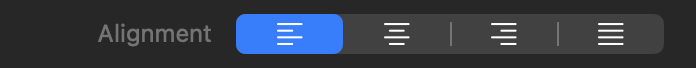



<p class="eyebrow">manifest.json · controls</p>
<h1>Text alignment</h1>
<p class="lede">A preconfigured segmented control that produces logical CSS text-alignment values.</p>


<figure class="control-screenshot">
    
    <figcaption>Start, Centre, End and Justify choices.</figcaption>
</figure>

## Quick example

Add this dictionary to your part's `controls` array:

```json
{
    "type" : "textAlignment",
    "id" : "alignment",
    "defaults" : {
        "base" : "start"
    }
}
```

Use it in the part's CSS template:

```css
:instance {
    text-align: {{ control.alignment }};
}
```


## Basic properties

Each item in `controls` defines one Inspector item. These keys set its name, placement, initial value and responsive behaviour.

<h3 class="property-heading"><code>type</code></h3>
<div class="property-meta"><span class="property-type">String</span><span class="required">Required</span></div>

Identifies this item as a Text alignment control. Always use `textAlignment`.

```json
"type" : "textAlignment"
```

<h3 class="property-heading"><code>id</code></h3>
<div class="property-meta"><span class="property-type">String</span><span class="required">Required</span></div>

The unique name used to store this control and read it in templates. It must start with a letter and may contain letters, numbers, underscores or hyphens.

```json
"id" : "alignment"
```

<h3 class="property-heading"><code>label</code></h3>
<div class="property-meta"><span class="property-type">String</span><span class="optional">Optional</span><span class="default">Default: empty</span></div>

Text shown beside the control in the Inspector.

```json
"label" : "Alignment"
```

<h3 class="property-heading"><code>group</code></h3>
<div class="property-meta"><span class="property-type">String</span><span class="optional">Optional</span><span class="default">Default: Settings</span></div>

The Inspector section that contains this control. Omit the key to place it in Settings.

```json
"group" : "Typography"
```

<h3 class="property-heading"><code>tooltip</code></h3>
<div class="property-meta"><span class="property-type">String</span><span class="optional">Optional</span><span class="default">Default: omitted</span></div>

Help text that explains what the control changes.

```json
"tooltip" : "Choose text alignment."
```

<h3 class="property-heading"><code>subtitle</code></h3>
<div class="property-meta"><span class="property-type">String array</span><span class="optional">Optional</span><span class="default">Default: []</span></div>

Supporting text for members of a control array. Use this key only when `count` is present.

```json
"subtitle" : [
    "First value",
    "Second value"
]
```

<h3 class="property-heading"><code>visibleWhen</code></h3>
<div class="property-meta"><span class="property-type">Dictionary</span><span class="optional">Optional</span><span class="default">Default: shown</span></div>

Shows this control only when another control meets the stated condition. See [Conditional visibility](visible-when.html).

```json
"visibleWhen" : {
    "id" : "showControl",
    "value" : true
}
```

<h3 class="property-heading"><code>valueAvailability</code></h3>
<div class="property-meta"><span class="property-type">String</span><span class="optional">Optional</span><span class="default">Default: always</span></div>

Controls when this control's value is available to templates. `always` preserves the value when the control is hidden. `whenVisible` makes `control.<id>` and its qualified derived values unavailable while `visibleWhen` is false, without discarding the stored value. `whenVisible` requires `visibleWhen`. See [Conditional visibility](visible-when.html).

<h3 class="property-heading"><code>defaults</code></h3>
<div class="property-meta"><span class="property-type">Dictionary</span><span class="required">Required</span></div>

A dictionary containing the required `base` value and optional breakpoint values: `small`, `medium`, `large`, `extraLarge`, and `doubleExtraLarge`. Breakpoint entries require `responsive: true`. Every entry uses the complete value format described below; omitted breakpoints inherit the preceding enabled value. Disabled project breakpoints are skipped without discarding their declarations. User overrides take precedence at the same breakpoint. Resetting an override restores the default cascade.

<h3 class="property-heading"><code>defaults.base</code></h3>
<div class="property-meta"><span class="property-type">String or String array</span><span class="required">Required</span></div>

The initially selected logical alignment. Use `start`, `center`, `end`, or `justify`.

```json
"defaults" : {
    "base" : "start"
}
```

<h3 class="property-heading"><code>responsive</code></h3>
<div class="property-meta"><span class="property-type">Boolean</span><span class="required">Required</span></div>

Set to true to allow a different value at each responsive breakpoint.

```json
"responsive" : false
```

## Text alignment options

These keys sit directly in the same custom-item dictionary. Omitted optional keys use the defaults shown.

<h3 class="property-heading"><code>count</code></h3>
<div class="property-meta"><span class="property-type">Integer</span><span class="optional">Optional</span><span class="default">Default: omitted</span></div>

Creates two to four text-alignment controls stored as one array.

```json
"count" : 2
```

<div class="guidance" markdown="1">
<h3>Logical alignment values</h3>

- `start` follows the writing direction’s starting edge.
- `center` centres each line.
- `end` follows the writing direction’s ending edge.
- `justify` expands spacing so lines meet both edges.

Use logical values rather than hard-coded left or right alignment so published content follows left-to-right and right-to-left writing modes.
</div>


## Return value

`{{ control.alignment }}` resolves as **CSS keyword: start, center, end, or justify**. Stored internally, its value is **String**.

```css
text-align: {{ control.alignment }};
```

## Complete example

### manifest.json

```json
"controls" : [
    {
        "type" : "textAlignment",
        "id" : "alignment",
        "label" : "Alignment",
        "group" : "Typography",
        "defaults" : {
            "base" : "start"
        },
        "responsive" : true
    }
]
```

### Use it in a template

```css
text-align: {{ control.alignment }};
```


