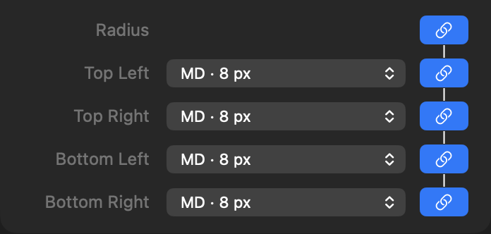



<p class="eyebrow">Info.plist · controls</p>
<h1>Theme radius</h1>
<p class="lede">Four always-visible corner rows with theme radius, custom lengths, and coordinated linking.</p>


<figure class="control-screenshot">
    
    <figcaption>All four corner rows remain visible when linked.</figcaption>
</figure>

## Quick example

Add this dictionary to your part's `controls` array:

```xml
<dict>
    <key>type</key><string>themeRadius</string>
    <key>id</key><string>themeRadius</string>
    <key>defaults</key>
    <dict>
        <key>base</key><string>sm</string>
    </dict>
</dict>
```

Use it in the part's CSS template:

```css
:instance {
    border-radius: {{ control.themeRadius }};
}
```

## Properties

<h3 class="property-heading"><code>type</code></h3>
<div class="property-meta"><span class="property-type">String</span><span class="required">Required</span></div>

Always `themeRadius`. This is a dedicated control, not a Select extension.

The control includes all four corners and built-in custom inputs. It does not accept `count`, `options`, `themeValues`, `allowsCustom`, `minimum`, `maximum`, `step`, or a top-level `unit`. Only the properties listed on this page are accepted.

<h3 class="property-heading"><code>id</code></h3>
<div class="property-meta"><span class="property-type">String</span><span class="required">Required</span></div>

Unique control identifier, starting with a letter and containing letters, numbers, underscores or hyphens. Templates access its fields through `{{ control.yourID.topLeft }}` or its complete shorthand through `{{ control.yourID }}`.

<h3 class="property-heading"><code>label</code></h3>
<div class="property-meta"><span class="property-type">String</span><span class="optional">Optional</span><span class="default">Default: Radius</span></div>

The control's label in the Inspector's normal left-hand label column, beside the all-corners link button. An omitted, empty or whitespace-only label displays Radius. The four fixed row labels are Top Left, Top Right, Bottom Left and Bottom Right.

<h3 class="property-heading"><code>group</code></h3>
<div class="property-meta"><span class="property-type">String</span><span class="optional">Optional</span><span class="default">Default: Settings</span></div>

The Inspector section containing the control.

<h3 class="property-heading"><code>defaults</code></h3>
<div class="property-meta"><span class="property-type">Dictionary</span><span class="required">Required</span></div>

A dictionary containing the required `base` value and optional breakpoint values: `small`, `medium`, `large`, `extraLarge`, and `doubleExtraLarge`. Breakpoint entries require `responsive: true`. Every entry uses the complete value format described below; omitted breakpoints inherit the preceding enabled value. Disabled project breakpoints are skipped without discarding their declarations. User overrides take precedence at the same breakpoint. Resetting an override restores the default cascade.

<h3 class="property-heading"><code>defaults.base</code></h3>
<div class="property-meta"><span class="property-type">String or Dictionary</span><span class="required">Required</span></div>

Declare one value for every corner, or a dictionary containing all four keys: `topLeft`, `topRight`, `bottomRight` and `bottomLeft`. Each corner accepts either:

- A portable theme radius ID: `xs`, `sm`, `md`, `lg`, `xl`, `2xl`, or `full`.
- `none`, which produces zero radius.
- A custom length dictionary containing exactly `value` (a finite, nonnegative Number) and `unit` (String: `px`, `rem`, `em`, or `%`).

A single token or custom length dictionary applies to all four corners. Four-corner dictionaries must include every corner and no other keys. Arrays, raw CSS strings such as `"16px"`, negative lengths and `auto` are not accepted. Only the predefined radius token IDs are supported; the theme sets their pixel values. `full` is a theme token (9,999px in the standard theme), not a percentage. Elliptical radii with separate horizontal/vertical values are not supported.

```xml
<key>defaults</key><dict><key>base</key><string>sm</string></dict>
```

For different initial values:

```xml
<key>defaults</key><dict><key>base</key><dict>
    <key>topLeft</key><string>lg</string>
    <key>topRight</key><string>sm</string>
    <key>bottomRight</key><string>lg</string>
    <key>bottomLeft</key>
    <dict>
        <key>value</key><real>1.5</real>
        <key>unit</key><string>rem</string>
    </dict>
</dict></dict>
```

Identical corner selections start linked; differing selections start independent. All four rows remain visible. Selecting Custom converts the selected theme amount to px as the starting value; the return-to-theme button restores the previous theme choice.

The header links all corners using Top Left. A pair button links Top Left–Top Right using Top Left, or Bottom Left–Bottom Right using Bottom Left, regardless of which button was clicked. Linking the second pair promotes to all-linked using Top Left. Unlinking preserves values. Linking also shares the custom/theme mode and unit; it does not merely copy the displayed number.

<h3 class="property-heading"><code>responsive</code></h3>
<div class="property-meta"><span class="property-type">Boolean</span><span class="optional">Optional</span><span class="default">Default: false</span></div>

Allows the whole four-corner value to override at a responsive breakpoint. There is one responsive indicator beside the main label, not one per corner. Editing at an overridden breakpoint stores all four selections and their link state together. Use the returned fields in the part's CSS template to generate responsive styles. Radius is shared between light and dark appearances.

<h3 class="property-heading"><code>tooltip</code></h3>
<div class="property-meta"><span class="property-type">String</span><span class="optional">Optional</span><span class="default">Default: Radius</span></div>

Help text for the overall control. Individual buttons retain their action-specific help.

<h3 class="property-heading"><code>subtitle</code></h3>
<div class="property-meta"><span class="property-type">String</span><span class="optional">Optional</span><span class="default">Default: empty</span></div>

Supporting text beneath the four-corner editor. Arrays are not accepted because this control does not support `count`.

<h3 class="property-heading"><code>visibleWhen</code></h3>
<div class="property-meta"><span class="property-type">Dictionary</span><span class="optional">Optional</span><span class="default">Default: shown</span></div>

Shows the complete control when another control meets the declared condition. See [Conditional visibility](visible-when.html). Radius itself is a structured value, not a scalar comparison source.

## Return value

Use `{{ control.themeRadius }}` directly to output the four CSS lengths in shorthand order: top left, top right, bottom right, bottom left. Qualified fields remain available:

- `topLeft`, `topRight`, `bottomRight`, `bottomLeft`: resolved CSS lengths.
- `css`: the four lengths in CSS shorthand order: top left, top right, bottom right, bottom left.
- `values`: an object containing the numeric amount for each corner (`topLeft`, `topRight`, `bottomRight`, `bottomLeft`).
- `units`: an object containing the corresponding unit String for each corner.

Theme choices resolve to CSS variable references, such as `var(--foundry-border-radius-sm)`, so theme edits continue to affect the part. Custom lengths include their units. None resolves to `0`. A missing theme radius choice remains marked as missing in the Inspector and resolves to `0` until replaced.

Do not append units to the CSS shorthand or individual CSS corner fields. Declaring the control does not apply radius automatically; the template chooses where to use it.

For calculations or JavaScript, use `values` together with `units`:

```text
{{ control.themeRadius.topLeft }}        → var(--foundry-border-radius-sm)
{{ control.themeRadius.values.topLeft }} → 4
{{ control.themeRadius.units.topLeft }}  → px
```

This example uses the standard theme's SM radius. Theme radius amounts resolve from the current theme in `px`; custom lengths retain their entered amount and unit (`px`, `rem`, `em`, or `%`). None and missing theme choices return numeric `0` and an empty unit String. A custom zero retains its chosen unit.

These amounts are not browser-computed pixel measurements: `1rem`, `1px`, and `1%` are different lengths. Theme amounts reflect the theme at rendering time, not later CSS variable overrides. Keep using the CSS fields for styles that should follow CSS variables.

## Example

Declare this item inside the `controls` array in `Info.plist`:

```xml
<dict>
    <key>type</key><string>themeRadius</string>
    <key>id</key><string>themeRadius</string>
    <key>label</key><string>Content radius</string>
    <key>group</key><string>Layout</string>
    <key>defaults</key><dict><key>base</key><string>sm</string></dict>
    <key>responsive</key><true/>
</dict>
```

Use it in the part's CSS template:

```css
:instance {
    border-radius: {{ control.themeRadius }};
}
```

Or apply individual corners:

```css
:instance {
    border-top-left-radius: {{ control.themeRadius.topLeft }};
    border-top-right-radius: {{ control.themeRadius.topRight }};
    border-bottom-right-radius: {{ control.themeRadius.bottomRight }};
    border-bottom-left-radius: {{ control.themeRadius.bottomLeft }};
}
```

