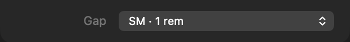



<p class="eyebrow">Info.plist · controls</p>
<h1>Theme spacing</h1>
<p class="lede">A single theme-aware spacing value with custom lengths. Label and apply it wherever a nonnegative spacing value is needed.</p>


<figure class="control-screenshot">
    
    <figcaption>Developers supply the label; this example uses the spacing value as a gap.</figcaption>
</figure>

## Quick example

Add this dictionary to your part's `controls` array:

```xml
<dict>
    <key>type</key><string>themeSpacing</string>
    <key>id</key><string>gap</string>
    <key>defaults</key>
    <dict>
        <key>base</key><string>sm</string>
    </dict>
</dict>
```

Use it in the part's CSS template:

```css
:instance {
    display: flex;
    gap: {{ control.gap }};
}
```

## Properties

<h3 class="property-heading"><code>type</code></h3>
<div class="property-meta"><span class="property-type">String</span><span class="required">Required</span></div>

Always `themeSpacing`. This is a single value, without edge rows or linking. It does not accept `count`, `options`, `themeValues`, `allowsCustom`, `minimum`, `maximum`, `step`, or a top-level `unit`.

<h3 class="property-heading"><code>id</code></h3>
<div class="property-meta"><span class="property-type">String</span><span class="required">Required</span></div>

Unique identifier starting with a letter and containing letters, numbers, underscores or hyphens. Examples use `gap`.

<h3 class="property-heading"><code>label</code></h3>
<div class="property-meta"><span class="property-type">String</span><span class="optional">Optional</span><span class="default">Default: Spacing</span></div>

Developer-supplied label in the normal Inspector row grid. Empty or whitespace-only labels fall back to Spacing.

<h3 class="property-heading"><code>group</code></h3>
<div class="property-meta"><span class="property-type">String</span><span class="optional">Optional</span><span class="default">Default: Settings</span></div>

Inspector section containing the control.

<h3 class="property-heading"><code>defaults</code></h3>
<div class="property-meta"><span class="property-type">Dictionary</span><span class="required">Required</span></div>

A dictionary containing the required `base` value and optional breakpoint values: `small`, `medium`, `large`, `extraLarge`, and `doubleExtraLarge`. Breakpoint entries require `responsive: true`. Every entry uses the complete value format described below; omitted breakpoints inherit the preceding enabled value. Disabled project breakpoints are skipped without discarding their declarations. User overrides take precedence at the same breakpoint. Resetting an override restores the default cascade.

<h3 class="property-heading"><code>defaults.base</code></h3>
<div class="property-meta"><span class="property-type">String or Dictionary</span><span class="required">Required</span></div>

A theme spacing token (`3xs`, `2xs`, `xs`, `sm`, `md`, `lg`, `xl`, `2xl`, `3xl`), `none`, or a custom length dictionary containing exactly `value` (finite, nonnegative Number) and `unit` (`px`, `rem`, `em`, `%`). Arrays, edge dictionaries, negative lengths, `auto`, and raw CSS strings such as `16px` are rejected.

The picker offers the current theme’s spacing choices, including user-created theme spacing values. Portable manifest defaults use the predefined tokens above. Custom inputs are always available. Switching to Custom starts with the resolved theme amount in `rem`; returning to theme restores the previous choice.

```xml
<key>defaults</key><dict><key>base</key><dict>
    <key>value</key><real>1.5</real>
    <key>unit</key><string>rem</string>
</dict></dict>
```

<h3 class="property-heading"><code>responsive</code></h3>
<div class="property-meta"><span class="property-type">Boolean</span><span class="optional">Optional</span><span class="default">Default: false</span></div>

Allows the selection to override at a responsive breakpoint. Use the output in the part’s CSS template for responsive rules. The selection is shared between light and dark appearances.

<h3 class="property-heading"><code>tooltip</code></h3>
<div class="property-meta"><span class="property-type">String</span><span class="optional">Optional</span><span class="default">Default: Spacing</span></div>

Help text for the control.

<h3 class="property-heading"><code>subtitle</code></h3>
<div class="property-meta"><span class="property-type">String</span><span class="optional">Optional</span><span class="default">Default: empty</span></div>

Supporting text beneath the control.

<h3 class="property-heading"><code>visibleWhen</code></h3>
<div class="property-meta"><span class="property-type">Dictionary</span><span class="optional">Optional</span><span class="default">Default: shown</span></div>

Shows the control when another control meets the condition. See [Conditional visibility](visible-when.html). Spacing itself is structured and is not a scalar comparison source.

## Return value

- `{{ control.gap }}`: resolved CSS length, such as `var(--foundry-space-sm)`.
- `{{ control.gap.css }}`: the same CSS length.
- `{{ control.gap.value }}`: numeric amount.
- `{{ control.gap.unit }}`: corresponding unit.

Theme amounts resolve in `rem`; custom amounts retain their entered unit. None and missing theme choices resolve to CSS `0`, numeric `0`, and an empty unit. A custom zero retains its chosen unit. Missing choices remain marked in the Inspector until replaced.

Do not append units to the CSS output. Numeric amounts are not browser-computed pixels: use the unit alongside the number. Theme amounts reflect the theme at render time, not subsequent CSS variable overrides.

## Example

```xml
<dict>
    <key>type</key><string>themeSpacing</string>
    <key>id</key><string>gap</string>
    <key>label</key><string>Gap</string>
    <key>group</key><string>Layout</string>
    <key>defaults</key><dict><key>base</key><string>sm</string></dict>
    <key>responsive</key><true/>
</dict>
```

```css
:instance {
    display: flex;
    gap: {{ control.gap }};
}
```

Declaring the control does not apply spacing automatically. The template chooses the CSS property. For independent row and column gaps, declare two controls with different IDs and labels.

